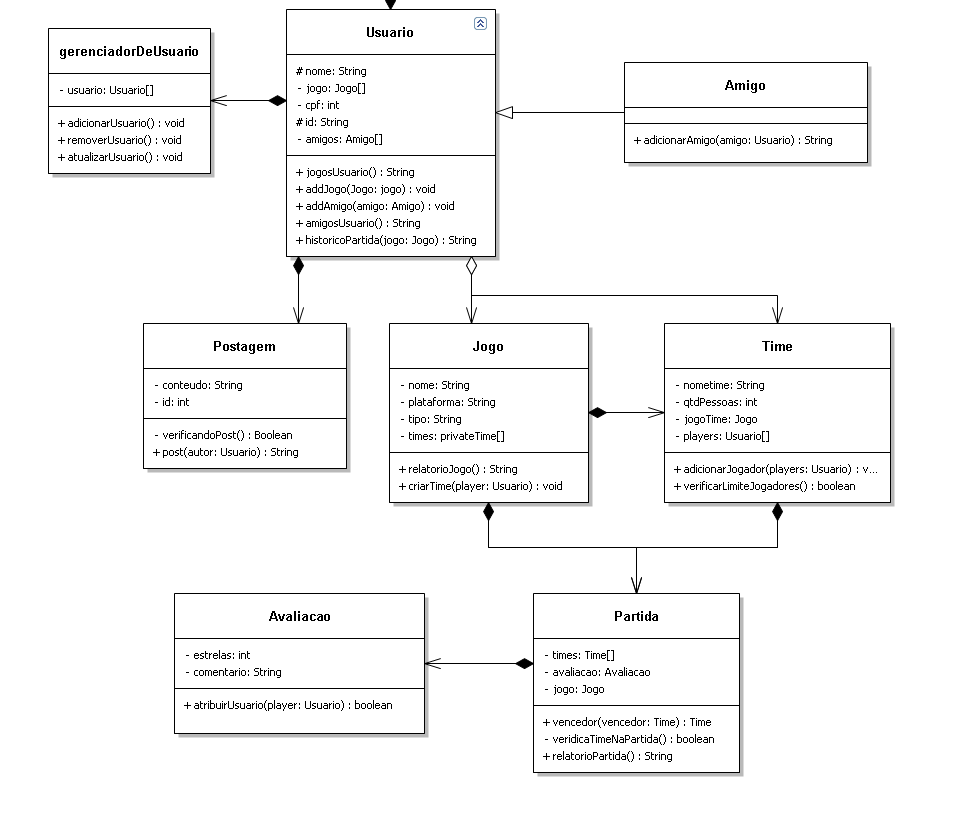
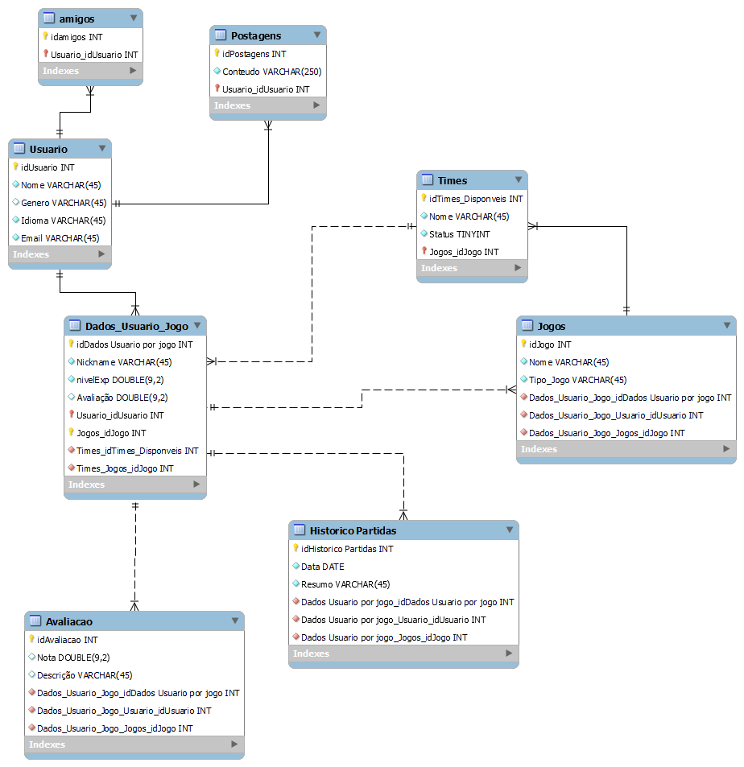

## 4. Projeto da solução

### 4.1. Diagrama de classes

  Usuario (User):
        A classe Usuario representa um usuário no sistema. Cada instância da classe Usuario possui informações específicas sobre um usuário, como seu nome, lista de amigos, jogos que joga e suas postagens na linha do tempo.
        Atributos:
            nome: Armazena o nome do usuário.
            amigos: É uma lista que armazena os amigos do usuário, usando a classe Amizade.
            jogos: É uma lista que armazena os jogos que o usuário joga, com os respectivos nicknames, usando a classe Jogo.
            postagens: É uma lista que armazena as postagens feitas pelo usuário na linha do tempo, usando a classe Postagem.

  Jogo (Game):
        A classe Jogo representa informações sobre um jogo que um usuário pode adicionar à sua lista de jogos. Cada instância da classe Jogo possui detalhes como o nome do jogo e a plataforma em que ele está sendo jogado.
  
  Postagem :
        A classe Postagem representa uma postagem feita por um usuário na linha do tempo. Cada instância da classe Postagem contém o conteúdo da postagem e o autor da postagem.
   Amizade :
        A classe Amizade é uma classe auxiliar para representar a relação de amizade entre dois usuários.
   Equipes : 
        Armazena os dados de uma equipe e adiciona players a equipe 
    
### 4.2. Diagrama de componentes

Navegador Web: A interface de usuário onde os usuários acessam o site. Ele interpreta HTML, CSS e JavaScript para renderizar a interface e interagir com o sistema.

Servidor Web: Recebe solicitações do navegador e as encaminha para o servidor de aplicação Java para processamento.

Servidor de Aplicação Java: Lida com a maior parte da lógica do servidor. Processa solicitações, acessa o banco de dados e interage com a API RESTful do LoL, retornando respostas aos clientes.

Banco de Dados (DB): Armazena informações do site, como dados de usuário, informações sobre jogos e postagens.

API do LoL (League of Legends API): Uma API externa usada para obter informações específicas do League of Legends, como dados de jogadores e partidas.

JavaScript no Navegador: Executa no navegador e é usado para fazer solicitações ao servidor, receber respostas e atualizar a interface do usuário.

_Apresente uma descrição detalhada dos artefatos que constituem o diagrama de componentes._

Exemplo: conforme diagrama apresentado, as entidades participantes da solução são:

**Front-end (HTML, CSS, JavaScript):
HTML: A estrutura do site é criada com HTML, definindo a organização de páginas, formulários e elementos.
CSS: O CSS é responsável pela estilização do site, definindo layout, cores, fontes e estilos visuais.
JavaScript: O JavaScript é usado para a interatividade do site, como validação de formulários, animações e integração com a API de estatísticas do LoL.

**Backend (Java):
Java: O código Java é responsável pelo desenvolvimento do backend, gerenciando solicitações do front-end, lógica de negócios e comunicação com o banco de dados e a API de estatísticas.

**Banco de Dados:
Um sistema de gerenciamento de banco de dados (como MySQL, PostgreSQL, ou outro) é usado para armazenar dados do site, como informações de usuários, partidas de LoL e estatísticas.

**API de Estatísticas de LoL:
A API de estatísticas de jogadores de LoL é integrada ao backend para recuperar e exibir informações relevantes sobre os jogadores, como histórico de partidas, estatísticas de campeões e classificações.

**Servidor Web:
Um servidor web (como Apache, Nginx ou outro) é usado para hospedar o site e permitir que os usuários acessem o front-end e façam solicitações ao backend.

**Comunicação entre Componentes:
Os componentes se comunicam por meio de solicitações HTTP e APIs RESTful. O front-end faz solicitações ao backend para obter dados de jogadores de LoL e enviar dados para o servidor. O backend se comunica com o banco de dados para armazenar e recuperar informações.

Este diagrama de componentes descreve a arquitetura geral do seu site, desde o front-end, que lida com a interface do usuário, até o backend, que processa lógica de negócios e integração com a API de estatísticas de jogadores de LoL e o banco de dados para armazenamento de dados.

### 4.3. Modelo de dados

### 4.4. Tecnologias

Hibernate é um framework de mapeamento objeto-relacional (ORM) para Java. Ele permite mapear objetos de uma aplicação para tabelas de um banco de dados relacional, facilitando o armazenamento e recuperação de dados.
    
  HTML (Hypertext Markup Language): Linguagem de marcação usada para estruturar o conteúdo de uma página web.
  CSS (Cascading Style Sheets): Linguagem usada para estilizar a apresentação do conteúdo HTML.
  JavaScript: Linguagem de programação usada para adicionar interatividade e comportamento dinâmico a páginas web.

  Spring Boot é um framework Java usado para criar aplicativos web. Ele simplifica o processo de configuração e desenvolvimento, fornecendo um ambiente robusto para criar aplicativos web baseados em Java.

  Log4J é uma biblioteca de log para aplicações Java. Ele permite gerar logs de diferentes níveis (como debug, info, erro) para acompanhar o comportamento e as atividades do sistema.

  JUnit é um framework de teste unitário para Java. Ele oferece uma estrutura para escrever e executar testes automatizados para garantir que o código funcione corretamente conforme o esperado.

  Github Pages é um serviço oferecido pelo Github que permite hospedar sites estáticos diretamente de repositórios do Github. É comumente usado para hospedar documentação, páginas pessoais e sites de projetos.

| **Dimensão**   | **Tecnologia**  |
| ---            | ---             |
| Banco de Dados   | railway       |
| Front end      | HTML+CSS+JS     |
| Back end       | Java SpringBoot |
| Log do sistema | Log4J           |
| Teste          | JUnit           |
| Deploy         | Render    |

### 4.5. Guias de estilo
*Página Incial*

*Página De Buscar Jogadores*

## Design

Detalhe os layouts que serão utilizados. Apresente onde será colocado o logo do sistema. Defina os menus padrões, entre outras coisas. 

- A logo ficará no canto superior esquerdo do sistema. 
- A barra do Menu ficara na lateral direita 
  - Na barra do Menu, como padrão vamos ter: 
    -  login/cadastro/perfil 
    - procurar times 
    - fazer Download 
    

## Cores

- As cores que serão utilizadas serão: Roxo, Azul e Amarelo.

## Tipografia

Apresente as fontes que serão utilizadas e sua função no site. 
- As fontes utilizadas serão: Futuristic Font e Regular sendo suas funções: fonte da logo e fonte dos textos respectivamente. As principais funções são: Título de página, Título de seção, Rótulos de componentes e Corpo de Texto.
## Iconografia

Logo do sistema:

Essa imagem mostra o CSS do menu lateral que esta em varias paginas do nosso site

